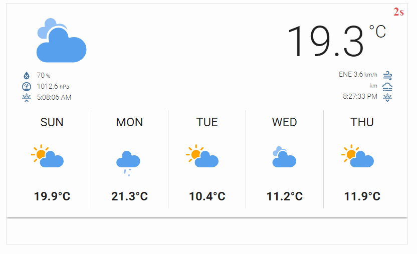

# Dashboard switcher

Dashboard switcher is a simple web app to be used to display multiple dashboards and switch between them in specific intervals.
I'm using it on my Raspberry Pi with original 7" display in living room to show some different stuff including a clock.

## Why?

I'm using [FullPageOS](https://github.com/guysoft/FullPageOS/) for that so natural choice was to use [FullPageDashboard](https://github.com/amitdar/FullPageDashboard) which does the job. Why write it from scratch?  
Well... I have been using **FullPageDashboard** at the beginning and in terms of features I was pretty happy.
However I've been having some performance issues while the dashboards were switched. The switch was taking sometimes even 4-5s to fully load.

Most of my dashboards come from **Home Assistant** and it takes some time to load on a Raspberry Pi. That was driving me nuts. I took some steps to see if that can be improved but failed with that so decided to try something different on my own.

This project is the outcome of few evenings playing with that. The approach I took to overcome the problem I had was quite simple. Let's have two iframes and preload next dashboard before the change happens and then just switch iframes visibility using simple CSS. This works instantaneous:



The result is even better than I expected. Even on my power desktop each **Home Assistant** dashboard takes at least half a second to properly lay out. With preload it's really really fast even on **Raspberry Pi**. I tried to do this as much lightweight as possible to save resources. There's only one external library to connect to MQTT, everything else is plain old JS.

There are not many features though (yet). There is no panel to configure the dashboards. That may change in future but for now suits me needs so it's not a priority.

# Installation

That's a simple static web page so you don't need any specific server-side solution. Anything able to host static pages will do. For inspiration please visit those pages:

- https://www.ostechnix.com/how-to-quickly-serve-files-and-folders-over-http-in-linux/
- https://gist.github.com/willurd/5720255

As you can see there's more than one way to skin a cat. Pick whichever you find the easiest for you. It can be even hosted somewhere in the cloud but I prefer to have it hosted at home for many reasons. It's your call though.

For example if you'd like to use http-server please do the following:

```cmd
$ npm install -g http-server
$ git clone https://github.com/ipatalas/dashboard-switcher.git
$ cd dashboard-switcher
$ http-server -p 8000
```

That will start HTTP server listening on port 8000.
Personally I'm using a Docker based **nginx** server but anything will really do. In future I plan to create a docker image from this so that it's self contained.

# Configuration

As I said before there's no configuration panel. To configure panels you should provide a link to JSON file which will serve as configuration.  
The URL to be opened should be http://*[host or ip]*:*port*/dashboard.html?config=***[config URL]***  
In my case it's http://home:3002/dashboard.html?config=http://home:3002/config.json because I'm hosting the config file along with the application but it can even be a **GitHub Gist** for instance. That way it's enough to have a single instance of the application even if you want to show different dashboards on different screens in each room. Just the configuration link will differ.

The configuration itself must be a JSON in the following structure:
```JSON
{
    "mqtt_button": {
        "server": "ws://mqtt_server:9001",
        "topic": "zigbee2mqtt/button"
    },
    "dashboards": [
        {
            "url": "http://home:8123/lovelace/commute_view?kiosk",
            "duration": "2m",
            "active_hours": "06:00-09:00"
        },
        {
            "url": "http://home:8123/lovelace/dashboard_view?kiosk",
            "duration": "5m",
            "active_hours": "05:00-23:00"
        },
        {
            "url": "http://home:8123/lovelace/clock_view?kiosk",
            "duration": "2m",
            "active_hours": "22:00-06:00"
        }
    ]
}
```

`mqtt_button` is optional. I do have a **Xiaomi WXKG11LM** button in the living room and pressing that once will switch to next dashboard automatically. Currently only this one is supported but I might want to make it more abstract so that arbitrary MQTT command can be used.

`dashboards` section is required as it serves all the dashboards that you want to cycle between. It's an array of objects with the following properties:
- `url` - the URL to load
- `duration` - time to show the dashboard in minutes or seconds (`5m`, `30s`, etc.)
- `active_hours` - that's the time window in which specific dashboard is active. Outside of this window that dashboard won't be shown. This is optional, when empty it will be shown **24/7**. Currently only *24h* format is supported.

# Known issues

Since this is using IFRAME under the hood not all pages from the internet can be displayed. Those with [X-Frame-Options](https://developer.mozilla.org/en-US/docs/Web/HTTP/Headers/X-Frame-Options) header or another type of frame buster won't work.  
That should not be a problem when using self hosted dashboards like **Home Assistant** for instance.

# Disclaimer

This is still a very naive solution which I'd consider alpha/beta. If something doesn't work please raise an issue.